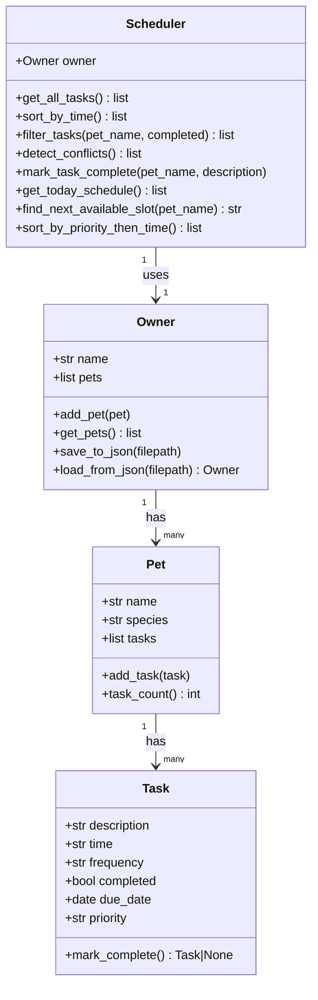

# PawPal+

> A smart pet care management system that tracks feedings, walks, medications, and appointments — with algorithmic scheduling built in.

**AI110 @ CodePath — Module 2 Project**

## Features

- **Add pets and tasks** through a clean Streamlit UI or CLI
- **Sorting by time** — schedule displays chronologically using HH:MM string sort
- **Conflict warnings** — detects when two tasks overlap at the same time slot
- **Daily/weekly recurrence** — completing a recurring task auto-schedules the next one using `timedelta`
- **Filtering** — view tasks by pet name or completion status
- **Priority scheduling** — sort by High/Medium/Low priority, then time (Extension 3)
- **Next available slot** — find the first free 30-min window from 07:00–21:00 (Extension 1)
- **JSON persistence** — save and reload your full schedule between sessions (Extension 2)
- **Professional CLI output** — formatted tables via `tabulate` (Extension 4)

## Getting Started

```bash
python -m venv .venv
source .venv/bin/activate   # Windows: .venv\Scripts\activate
pip install -r requirements.txt

python main.py          # CLI demo with all features
streamlit run app.py    # Web UI
```

## Testing

```bash
python -m pytest tests/ -v
```

14 tests covering:

| Test | Behavior |
|------|----------|
| `test_task_completion_changes_status` | Marking done sets `completed=True` |
| `test_daily_task_creates_next_occurrence` | Daily recurrence creates tomorrow's task |
| `test_weekly_task_creates_next_occurrence` | Weekly recurrence creates next-week's task |
| `test_once_task_returns_none_on_complete` | One-time tasks do not recur |
| `test_adding_task_increases_pet_task_count` | `task_count()` increments correctly |
| `test_sorting_returns_chronological_order` | `sort_by_time()` is chronological |
| `test_conflict_detection_flags_same_time` | Duplicate times produce warnings |
| `test_no_conflict_when_times_differ` | No false positives for unique times |
| `test_filter_by_completion_status` | Filters correctly to incomplete only |
| `test_mark_complete_adds_recurrence_to_pet` | Recurrence appended to correct pet |
| `test_filter_by_pet_name` | Filters tasks to a single pet |
| `test_get_all_tasks_count` | `get_all_tasks()` spans all pets |
| `test_find_next_available_slot_avoids_occupied` | Slot finder skips occupied times |
| `test_priority_sort_high_before_low` | High priority surfaces first |

**Confidence Level: ⭐⭐⭐⭐☆** — Core logic fully covered. Untested edge cases: empty owner, weekly recurrence crossing a month boundary, tasks with identical descriptions on different pets.

## Smarter Scheduling

PawPal+'s `Scheduler` class implements four algorithms:

1. **Time sort**: `sorted(tasks, key=lambda t: t.time)` — lexicographic sort works correctly for zero-padded HH:MM strings
2. **Conflict detection**: O(n²) pairwise comparison — returns warning strings, never raises an exception
3. **Recurrence**: `Task.mark_complete()` returns a new `Task` with `due_date + timedelta(days=1 or weeks=1)`
4. **Priority sort**: Two-key sort `(priority_order[priority], time)` for priority-first, time-tiebreak ordering

## Architecture

```
pawpal_system.py    # All backend logic (Owner, Pet, Task, Scheduler) — no Streamlit imports
app.py              # Streamlit UI — imports from pawpal_system, manages session state
main.py             # CLI demo — exercises all features with tabulate-formatted output
tests/
  test_pawpal.py    # 14-test pytest suite
reflection.md       # Design decisions and AI collaboration notes
data.json           # Persisted schedule (generated at runtime by save button or CLI)
```

The two-layer design keeps `pawpal_system.py` fully testable without a browser. All algorithmic logic lives in `Scheduler`; `Owner` and `Pet` are pure data containers.

## Class Diagram


